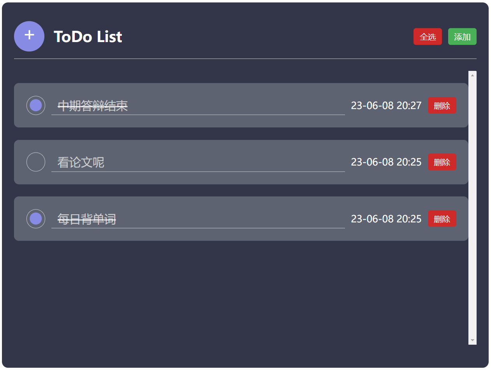

# todo-list-demo

# 项目预览

- 添加task
- 删除task
- 全选task



# 运行方法

- 克隆本项目
- 在项目目录内打开终端`npm run serve`

# 功能实现函数

## 添加

```js
// 添加功能
    handleAdd() {
      this.todoList.unshift({
        id: this.randomID(),
        isChaeck: false, // 是否选中
        text: "", // input内容
        time: dayjs(new Date).format("YY-MM-DD HH:mm"),  // 时间
      })
    },
```

## 删除

```js
// 删除功能
    handleDelItem(index, id) {
      if (this.todoList[index].id == id) {
        this.todoList.splice(index, 1)
      };
      this.storage();
    },
```

## 选中

```js
// 选中功能
    handleSelected(index, id) {
      // alert(index);
      // alert(id)
      if (this.todoList[index].id == id) {
        this.todoList[index].isChaeck = !this.todoList[index].isChaeck
      };
      this.storage();
    },
```

## 全选

```js
// 全选
    handleAllSelected() {
      this.todoList.forEach(item => {
        // console.log(item)
        item.isChaeck = !item.isChaeck;
      });
      this.storage();
    },
```

## 存储

```js
// 存储功能
    storage() {
      window.localStorage.setItem('lsitToDo', JSON.stringify(this.todoList))
    },
```

## 其他

```js
//判断是否输入完成
    handleBlur() {
      this.storage();
    },
    // 生成随机数的id
    randomID() {
      return Number(Math.random().toString().substring(0, 1) + Date.now()).toString(10)
    }
```

